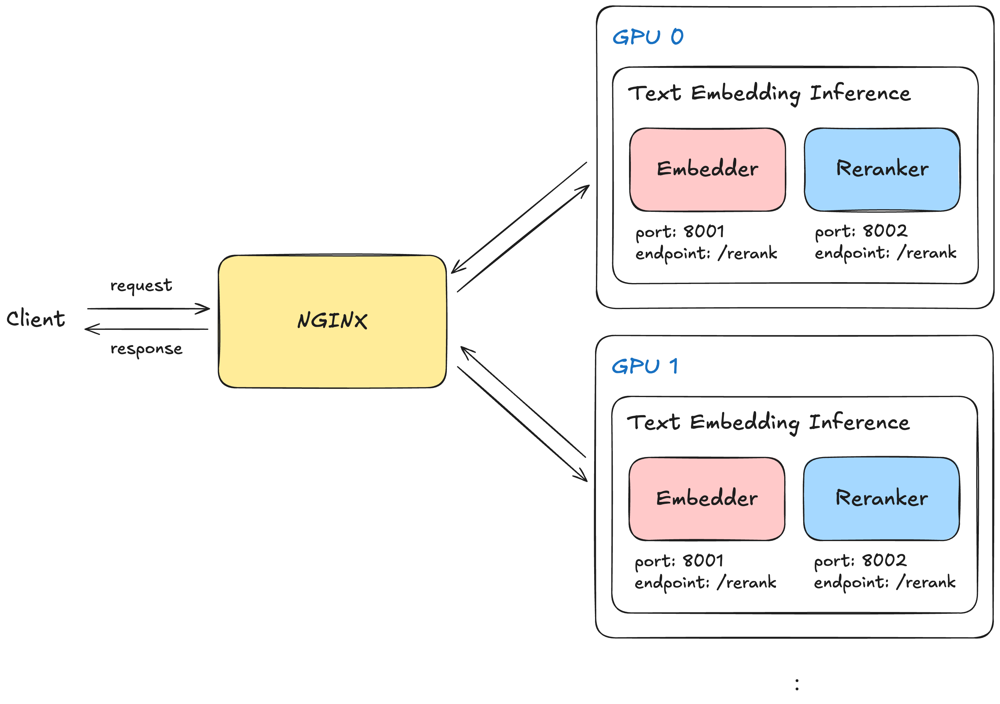

# Text Embeddings Inference Multi-GPU Serving

## Overview
This system provides load balancing for Text Embeddings Inference (TEI) containers using Nginx, enabling efficient inference across multiple GPUs. The architecture distributes incoming requests to multiple TEI containers to maximize GPU utilization and improve inference performance.

## Architecture


The system consists of:
- Multiple TEI containers running on separate GPUs
- Nginx as a load balancer to distribute requests
- Configuration for both embedding and reranking services

## Components

### Nginx Load Balancer
- Uses separate configuration files for each service type:
  - `nginx-embedder.conf`: Defines the `bge-embedder-tei` upstream for embedding services
  - `nginx-reranker.conf`: Defines the `bge-reranker-tei` upstream for reranking services
- Routes requests to appropriate TEI container instances

### TEI Containers
- Each container runs on a dedicated GPU
- Support for different GPU types (T4, L4, A100, H100)
- Configured for specific models:
  - Embedding model: `BAAI/bge-m3` (exposed on port 8001)
  - Reranking model: `BAAI/bge-reranker-v2-m3` (exposed on port 8002)

## Setup and Configuration

### Docker Network
The system uses a custom Docker network (`tei-net`) to connect all containers.

### Dockerfile
A simple Dockerfile based on the nginx image:
```
FROM nginx:latest
RUN rm /etc/nginx/conf.d/default.conf
COPY nginx.conf /etc/nginx/conf.d/default.conf
EXPOSE 80
```

### Configuration Files
- `nginx-embedder.conf`: Configuration for embedding service load balancing
- `nginx-reranker.conf`: Configuration for reranking service load balancing

## Deployment

### Running the System
1. To start the entire system with both embedder and reranker services:
```bash
./run.sh [GPU_TYPE]
```
Where `GPU_TYPE` is one of: T4 (default), L4, A100, or H100.

2. The script will:
   - Create a Docker network
   - Start two TEI containers for each service (embedder and reranker)
   - Configure and start Nginx load balancers for each service

### Access Points
- Embedding service: http://localhost:8001/embed
```
# 1. single request
curl 127.0.0.1:8001/embed \
    -X POST \
    -d '{"inputs":"What is Deep Learning?"}' \
    -H 'Content-Type: application/json'

# 2. batch request
curl 127.0.0.1:8001/embed \
    -X POST \
    -d '{"inputs":["Today is a nice day", "I like you"]}' \
    -H 'Content-Type: application/json'
```
- Reranking service: http://localhost:8002/rerank
```
curl 127.0.0.1:8002/rerank \
    -X POST \
    -d '{"query":"What is Deep Learning?", "texts": ["Deep Learning is not...", "Deep learning is..."], "raw_scores": false}' \
    -H 'Content-Type: application/json'
```

## Data Storage
The system mounts a local `data` directory to each container for persistent storage and model caching.
